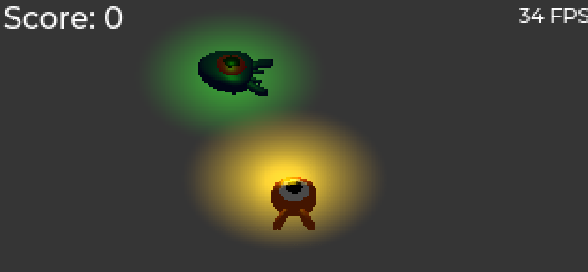

# Squash the creeps

This repo contains the completed godot tutorial called
the [Your first 3D game](https://docs.godotengine.org/en/4.1/getting_started/first_3d_game/index.html).

Some notes:

- .NET version of godot is used in this project
- I shrank the viewport to microscopic size so my shitty
  laptop could get some decent framerate.
